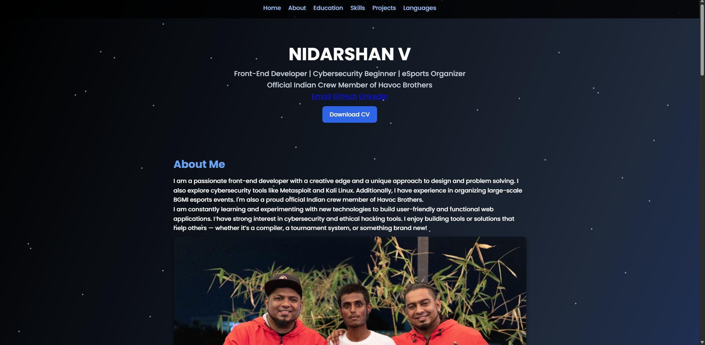

# Nidarshan Portfolio 🚀

Welcome to my personal portfolio website!  
This site showcases my work in front-end development, cybersecurity learning, and esports event organizing.

🔗 **Live Site**: [https://nidarshan-portfolio.netlify.app](https://nidarshan-portfolio.netlify.app)  
🔗 **GitHub Pages**: [https://havoc-nj.github.io/nidarshan-portfolio](https://havoc-nj.github.io/nidarshan-portfolio)
## 🔍 Live Preview

## 📄 Features
- Responsive HTML, CSS, and JS layout
- Project Gallery with real-time screenshots
- Downloadable Resume (CV)
- Background particle animation
- Contact Form powered by Formspree

## 🛠 Technologies
- HTML5, CSS3, JavaScript
- Formspree (Contact form)
- Netlify / GitHub Pages

## ✍ Author
**Nidarshan V.**  
Official Indian Crew Member of Havoc Brothers  
Email: imhavocns@gmail.com
